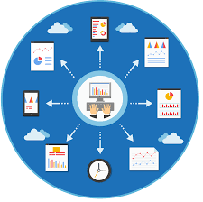

# Base de Datos para Aplicaciones

---

Este repsitorio contiene informacion de base de Dtos refente a los siguientes temas 

1. Consultas con join (inner join, left join, rigt join y full join)
1. Views
1. Store Procedures
1. Triggers
1. Manejo de tRansacciones
1. Seguridad
1. Despliegue de Aplicaciones

[Definicion de Base de Datos](https://aws.amazon.com/es/what-is/database/)